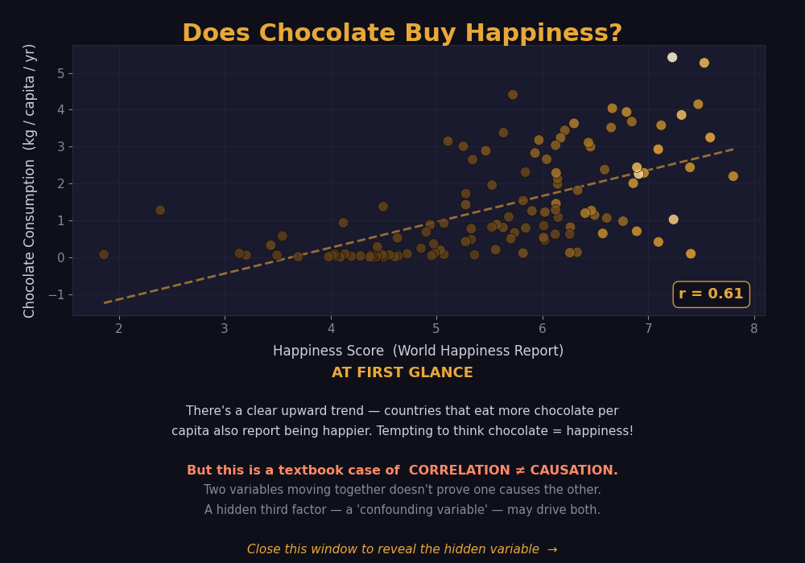
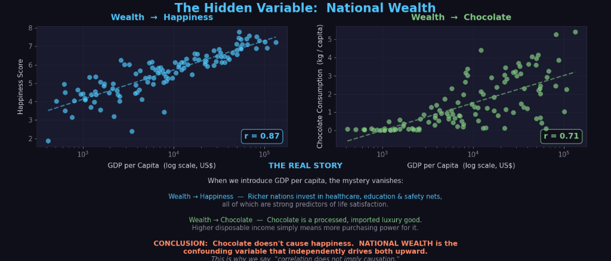

# Correlation vs. Causation: Chocolate, Happiness, and Wealth

A data visualization project demonstrating the classic statistical fallacy of confusing correlation with causation, using real-world data about chocolate consumption, happiness scores, and national wealth (GDP per capita).

## The Concept

This project presents two interactive slides to illustrate a crucial concept in data analysis:

### Slide 1 — The Tempting Correlation

The first slide shows a clear positive trend between a country's chocolate consumption and its happiness score (**r = 0.61**). It's tempting to conclude that eating chocolate makes a nation happier.



### Slide 2 — The Real Story

The second slide reveals the "confounding variable" — **National Wealth (GDP per capita)**. When we control for wealth, we see that richer nations tend to have higher happiness scores (**r = 0.87**) due to better healthcare, education, etc., and also have more disposable income to consume imported luxury goods like chocolate (**r = 0.71**).



**Conclusion:** Chocolate doesn't cause happiness; national wealth is the underlying factor driving both.

## Features

-   **Interactive Matplotlib Visualizations:** Uses `matplotlib` and `seaborn` to create centered, interactive popup windows.
-   **Dark Theme Aesthetics:** A modern, clean dark theme with carefully selected accent colors (gold, blue, green).
-   **Statistical Analysis:** Calculates and displays the Pearson correlation coefficient (r-value) for each relationship.
-   **Linear Regression:** Fits and plots linear regression trend lines (including logarithmic scales for GDP) to highlight the trends.

## Data Sources

The project uses three datasets (included as CSV files):
-   `happiness_data.csv`: World Happiness Report scores.
-   `chocolate_data.csv`: Chocolate consumption per capita.
-   `income_data.csv`: GDP per capita (current US$).

## Setup and Usage

1.  **Clone the repository:**
    ```bash
    git clone https://github.com/omkar-prabhu-github/Correlation.git
    cd Correlation
    ```

2.  **Install dependencies:**
    Ensure you have Python installed. Install the required packages using pip:
    ```bash
    pip install pandas matplotlib numpy seaborn
    ```
    *(Note: seaborn is used for color palettes in the current implementation, though the main plots use matplotlib directly).*

3.  **Run the visualization:**
    ```bash
    python visualisation.py
    ```
    The script will open the first visualization window. **Close the first window to view the second slide.**
              